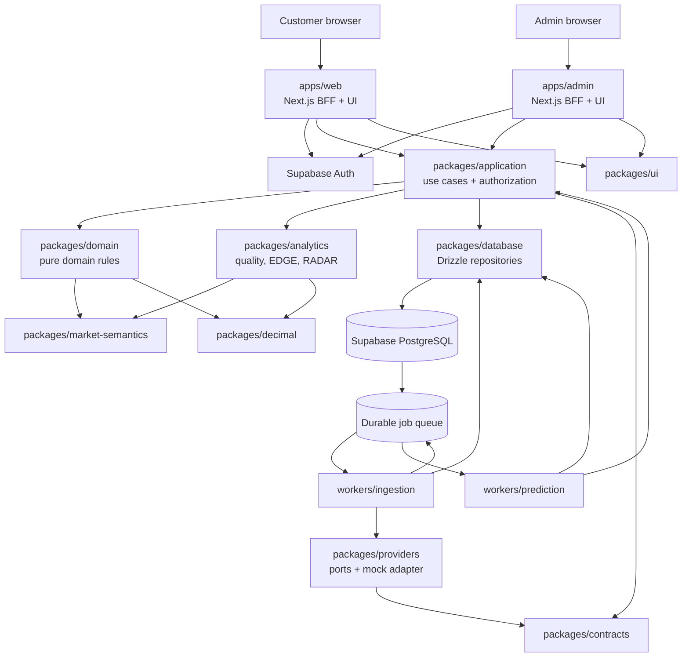

# VELYQ Phase 1 Design Specification

**Status:** Proposed for implementation approval

**Date:** 2026-09-03

**Scope:** Foundation Vertical Slice
**Product:** VELYQ — AI Sports Market Intelligence

## 1. Purpose and governing principles

Phase 1 proves one traceable path from deterministic synthetic provider observations to a user-facing Match Intelligence view and an authorized admin trace. It is not a production prediction system or a real sports-data integration.

The following rules are architectural invariants:

- All sports-market claims are probabilistic; VELYQ never claims certainty or guaranteed returns.
- Core market arithmetic uses arbitrary-precision decimal values, never JavaScript `number`.
- Market identity and settlement behavior are canonical, typed, and versioned.
- Provider payloads never leak past adapters into domain logic.
- Odds observations and published predictions are append-only.
- Every derived result is traceable to source observations, versions, policies, and timestamps.
- Phase 1 EDGE and RADAR scores are labeled `DEVELOPMENT_HEURISTIC`, never `VALIDATED_MODEL`.
- Synthetic data is fictional, deterministic, replayable, and visibly labeled.
- `NO_BET`, `WAIT`, `WAIT_FOR_LINEUP`, `INSUFFICIENT_DATA`, and `EDGE_DISAPPEARED` are first-class outcomes.

## 2. Final architecture



Phase 1 may execute queue consumers as local processes and CI jobs. Vercel hosts only request-oriented web/admin workloads. The worker packages remain deployable to persistent compute later without changing their domain interfaces.

## 3. Repository and package boundaries

```text
apps/
  web/                  Customer App Router application and BFF
  admin/                Separate protected admin application and BFF
workers/
  ingestion/            Pull/replay provider observations and enqueue work
  prediction/           Execute prediction, quality, EDGE, and RADAR flows
packages/
  decimal/              Decimal runtime, value objects, database codecs
  market-semantics/     Canonical market identity and settlement contracts
  domain/               Events, odds, predictions, decisions, provenance
  analytics/            Value, no-vig, EDGE, RADAR, data-quality calculations
  application/          Use cases, authorization, transactions, orchestration
  providers/            Provider ports, policies, mappings, mock adapter
  contracts/            Versioned API and job schemas
  database/             Drizzle schema, SQL migrations, repositories, RLS
  auth/                 Roles, permissions, entitlement decision interfaces
  ui/                   VELYQ design tokens and reusable presentation primitives
  observability/        Structured logs and request/job correlation
  config/               Typed server/client environment parsing
  test-utils/           Fixtures, clocks, factories, test identities
tooling/
  eslint/ typescript/ tailwind/
docs/
  architecture/ decisions/ superpowers/
```

### 3.1 Phase 1 responsibilities

| Package | Owns | Must not own |
|---|---|---|
| `decimal` | Decimal.js configuration; branded value objects; NUMERIC codecs | Betting rules, UI formatting policy |
| `market-semantics` | Canonical market keys, scopes, periods, lines, outcomes, settlement rule versions | Provider transport, database access |
| `domain` | Entity types, prediction/decision state, immutable observation rules | Next.js, Drizzle, Supabase clients |
| `analytics` | Implied probability, no-vig, EV, EDGE, RADAR, quality policies | Persistence, HTTP, provider payloads |
| `providers` | Capability ports, policy evaluation, normalization, synthetic replay | Application authorization, UI |
| `application` | Use cases, ports, authorization checks, orchestration | Framework route details |
| `contracts` | Runtime-validated API/job DTOs and schema versions | Domain calculation implementation |
| `database` | Schema, migrations, RLS, repository adapters, transactions | User-interface behavior |
| `auth` | Role/permission and entitlement decision contracts | Session UI |
| `ui` | Presentational primitives, formatting adapters, localization keys | Domain calculations or database queries |

### 3.2 Dependency rules

Permitted dependency direction:

```text
decimal <- market-semantics <- domain <- analytics
                   ^             ^          ^
                   |             |          |
contracts <- providers       application ---+
                       database adapters --> application ports
apps/workers --> application + contracts + UI/observability/config
```

- `decimal`, `market-semantics`, and `domain` are framework-free.
- `domain` cannot import `analytics`; analytics consumes domain concepts.
- `application` depends on interfaces, not Drizzle repositories or provider implementations.
- Database and provider packages implement application ports.
- Apps and workers are composition roots.
- Cross-package imports use public exports only; direct imports into another package's internals fail linting.
- No package accepts `any` across a boundary. Unknown external data is parsed from `unknown`.

## 4. Decimal and value-object design

Use `decimal.js` with a single centrally configured constructor. Configuration, rounding modes, serialization, and precision are established in `packages/decimal`; consumers may not instantiate their own decimal configuration.

Domain constructors accept canonical decimal strings and return immutable branded objects:

```ts
type DecimalString = string & { readonly __brand: 'DecimalString' };
type DecimalOdds = { readonly kind: 'DecimalOdds'; readonly value: DecimalString };
type Probability = { readonly kind: 'Probability'; readonly value: DecimalString };
type FairProbability = Probability & { readonly __fair: true };
type ImpliedProbability = Probability & { readonly __implied: true };
type Edge = { readonly kind: 'Edge'; readonly value: DecimalString };
type ExpectedValue = { readonly kind: 'ExpectedValue'; readonly value: DecimalString };
type MarketLine = { readonly kind: 'MarketLine'; readonly value: DecimalString };
type Money = { readonly kind: 'Money'; readonly amount: DecimalString; readonly currency: string };
```

Validation rules:

- `Probability`, `FairProbability`, and `ImpliedProbability`: inclusive range `[0, 1]`.
- `DecimalOdds`: strictly greater than `1` for Phase 1 bookmaker prices.
- `Edge` and `ExpectedValue`: signed, finite decimals with configured storage bounds.
- `MarketLine`: signed finite decimal; allowed increments are validated by market semantics, not globally.
- `Money`: finite amount plus ISO 4217 currency; Phase 1 defines the type but stores no money.

Canonical serialization uses plain, non-exponential base-10 strings. PostgreSQL `numeric` values are read as strings, converted through the value-object constructor, and written as strings. JSON DTOs transmit decimal strings. Formatting into percentages or localized display values occurs only at the UI boundary.

Pure analytics functions include `impliedProbability`, `fairOdds`, `expectedValue`, `probabilityEdge`, `proportionalNoVig`, and price-movement calculations. Inputs and outputs use typed value objects.

## 5. Market semantics

`packages/market-semantics` is the single canonical definition used by odds, predictions, settlement, Builder rules, and performance analysis.

### 5.1 Canonical identity

A `MarketKey` contains:

- `sportCode`
- `familyCode` such as `MATCH_RESULT`, `TOTAL`, `ASIAN_TOTAL`, `HANDICAP`, `PLAYER_SHOTS`
- `periodCode` such as `FULL_TIME`, `FIRST_HALF`
- `structure` (`TWO_WAY`, `THREE_WAY`, `MULTI_OUTCOME`)
- `subjectType` (`EVENT`, `TEAM`, `PLAYER`)
- optional subject identifier role
- optional `line`
- outcome/side code
- settlement-rule version

The stable identity is a canonical serialized key and database UUID. Human labels are localization keys, never identity fields.

### 5.2 Market template and instance

- A **market definition** describes reusable semantics: sport, family, period, structure, subject scope, whether a line is required, allowed line increments, and settlement-rule version.
- An **event market** binds that definition to an event and optional team/player subject plus line.
- An **event market outcome** identifies a selectable side such as `HOME`, `DRAW`, `AWAY`, `OVER`, `UNDER`, or `YES`.

This distinguishes full-time 1X2 from first-half 1X2, total 2.5 from Asian total 2.25, and event totals from team/player totals.

### 5.3 Settlement contracts

A versioned `SettlementRule` specifies:

- regulation/period boundary
- extra-time and shootout inclusion
- push/half-win/half-loss behavior
- void conditions
- abandoned/postponed behavior
- participant non-participation rules
- source statistic and result resolver
- valid result statuses

Settlement output supports `WIN`, `LOSS`, `PUSH`, `HALF_WIN`, `HALF_LOSS`, `VOID`, and `UNSETTLED`. Phase 1 implements settlement only for full-time 1X2 and full-time Over/Under 2.5 synthetic examples, while schema/contracts support future rules.

Provider market mappings are versioned records from provider keys to canonical definition/outcome keys. Ambiguous or unmapped markets are quarantined; ingestion must not guess.

## 6. Provider contracts, rights, and raw payloads

### 6.1 Capability ports

Phase 1 defines narrow ports:

```ts
interface FixtureSource { listFixtureObservations(request): Promise<FixtureObservationBatch>; }
interface OddsSource { listOddsObservations(request): Promise<OddsObservationBatch>; }
interface LineupSource { listLineupObservations(request): Promise<LineupObservationBatch>; }
```

Each batch includes provider code, capability, schema version, observation window, provider request ID, received time, normalization version, mapping version, and normalized observations.

### 6.2 Data-rights policy

`ProviderDataPolicy` is an effective-dated policy document interpreted by a domain service, not a set of scattered booleans. It expresses grants/constraints for actions:

- retain raw
- retain normalized
- display by audience
- redistribute/export
- cache
- model training
- backtesting
- replay

Constraints can include retention duration, audience, environment, territory, data category, and required attribution. Ingestion asks the policy evaluator before storage; query/application use cases ask it before display/export; lifecycle jobs enforce deletion/expiry.

Phase 1 registers a synthetic-provider policy permitting repository fixtures, normalized storage, replay, display, and tests. No object storage is provisioned.

### 6.3 Raw payload metadata

Future real-provider payload metadata lives in PostgreSQL while bytes may live in Supabase Storage or S3-compatible storage. Metadata includes provider, run, content hash, media type, byte size, received/observed time, provider/schema version, storage URI, retention policy/version, expiry, licensing policy/version, and replay eligibility. Phase 1 keeps synthetic fixture files in Git and records their fixture path/content hash on the provider run.

## 7. Provenance model

Every material observation carries a `ProvenanceRef` with:

- provider ID and provider external ID
- provider observation time
- VELYQ received time
- VELYQ normalized time
- ingestion run ID
- normalization version
- mapping version
- source observation ID

Derived records contain lineage links rather than copying unverifiable descriptions. A prediction links to its input observation set; EDGE and RADAR outputs link to the prediction/odds evidence they used. All application queries that reconstruct historical state accept an `asOf` cutoff and filter on both provider observation time and VELYQ received time as required by the analysis policy.

## 8. Exact Phase 1 database scope

All IDs are UUIDs. All timestamps are `timestamptz` in UTC. Decimal fields are PostgreSQL `numeric` and application codecs return strings. `created_at` is required unless a more specific immutable timestamp is stated.

### 8.1 Identity and authorization

#### `public.profiles`

- `user_id uuid` PK, FK → `auth.users.id` ON DELETE CASCADE
- `display_name text` nullable
- `locale text` NOT NULL default `en`
- `timezone text` NOT NULL default `UTC`
- `created_at`, `updated_at`

Indexes/constraints: valid locale/timezone application validation. User owns exactly one row.

#### `private.roles`

- `id uuid` PK
- `code text` UNIQUE NOT NULL (`USER`, `ADMIN` initially)
- `description text`

#### `private.permissions`

- `id uuid` PK
- `code text` UNIQUE NOT NULL
- `description text`

Phase 1 permissions: `admin.access`, `provider_runs.read`, `predictions.trace`, `scores.inspect`, `quality.inspect`, `audit.read`.

#### `private.role_permissions`

- `role_id` FK → roles
- `permission_id` FK → permissions
- composite PK `(role_id, permission_id)`

#### `private.user_roles`

- `user_id` FK → `auth.users.id`
- `role_id` FK → roles
- `granted_by uuid` FK → `auth.users.id`
- `granted_at timestamptz`
- composite PK `(user_id, role_id)`
- index `(role_id, user_id)`

### 8.2 Catalog and events

#### `catalog.sports`

- `id uuid` PK
- `code text` UNIQUE NOT NULL (`FOOTBALL`)
- `name_key text` UNIQUE NOT NULL

#### `catalog.competitions`

- `id uuid` PK
- `sport_id` FK → sports
- `code text` NOT NULL
- `name_key text` NOT NULL
- `country_code char(2)` nullable
- UNIQUE `(sport_id, code)`

#### `catalog.participants`

- `id uuid` PK
- `sport_id` FK → sports
- `type text` NOT NULL CHECK in (`TEAM`, `PLAYER`)
- `code text` NOT NULL
- `display_name text` NOT NULL; synthetic-only Phase 1 content
- UNIQUE `(sport_id, type, code)`

#### `catalog.events`

- `id uuid` PK
- `sport_id` FK → sports
- `competition_id` FK → competitions
- `season_label text`
- `starts_at timestamptz` NOT NULL
- `status text` NOT NULL
- `synthetic boolean` NOT NULL CHECK (`synthetic = true` in Phase 1 seed)
- `created_at`
- indexes `(starts_at, status)`, `(competition_id, starts_at)`

#### `catalog.event_participants`

- `event_id` FK → events
- `participant_id` FK → participants
- `role text` NOT NULL (`HOME`, `AWAY`)
- composite PK `(event_id, role)`
- UNIQUE `(event_id, participant_id)`

### 8.3 Providers and provenance

#### `operations.providers`

- `id uuid` PK
- `code text` UNIQUE NOT NULL
- `display_name text` NOT NULL
- `is_synthetic boolean` NOT NULL
- `created_at`

#### `operations.provider_policy_versions`

- `id uuid` PK
- `provider_id` FK → providers
- `version text` NOT NULL
- `policy jsonb` NOT NULL
- `effective_from timestamptz` NOT NULL
- `effective_to timestamptz` nullable
- `created_at`
- UNIQUE `(provider_id, version)`
- index `(provider_id, effective_from DESC)`

#### `operations.provider_sync_runs`

- `id uuid` PK
- `provider_id` FK → providers
- `capability text` NOT NULL
- `status text` NOT NULL
- `replay_sequence text` nullable
- `fixture_path text` nullable
- `content_hash text` nullable
- `provider_schema_version text` NOT NULL
- `normalization_version text` NOT NULL
- `mapping_version text` NOT NULL
- `policy_version_id` FK → provider_policy_versions
- `started_at`, `completed_at` nullable
- `received_count`, `accepted_count`, `rejected_count integer` NOT NULL default 0
- `error_summary jsonb` nullable
- index `(provider_id, started_at DESC)`, `(status, started_at DESC)`

#### `operations.source_observations`

- `id uuid` PK
- `provider_id` FK → providers
- `sync_run_id` FK → provider_sync_runs
- `observation_type text` NOT NULL
- `provider_external_id text` NOT NULL
- `provider_observed_at timestamptz` NOT NULL
- `received_at timestamptz` NOT NULL
- `normalized_at timestamptz` NOT NULL
- `normalization_version text` NOT NULL
- `mapping_version text` NOT NULL
- `content_hash text` NOT NULL
- UNIQUE `(provider_id, observation_type, content_hash)`
- indexes `(sync_run_id)`, `(provider_id, provider_observed_at DESC)`

This table stores trace metadata, not arbitrary raw payload bodies.

### 8.4 Market semantics and odds

#### `market.market_definitions`

- `id uuid` PK
- `sport_id` FK → sports
- `code text` NOT NULL
- `family_code text` NOT NULL
- `period_code text` NOT NULL
- `structure text` NOT NULL
- `subject_type text` NOT NULL
- `line_required boolean` NOT NULL
- `line_rules jsonb` NOT NULL
- `settlement_rule_version text` NOT NULL
- `label_key text` NOT NULL
- UNIQUE `(sport_id, code)`

#### `market.outcome_definitions`

- `id uuid` PK
- `market_definition_id` FK → market_definitions
- `code text` NOT NULL
- `label_key text` NOT NULL
- `sort_order smallint` NOT NULL
- UNIQUE `(market_definition_id, code)`

#### `market.provider_market_mappings`

- `id uuid` PK
- `provider_id` FK → providers
- `provider_market_key text` NOT NULL
- `provider_outcome_key text` NOT NULL
- `market_definition_id` FK → market_definitions
- `outcome_definition_id` FK → outcome_definitions
- `mapping_version text` NOT NULL
- `effective_from timestamptz` NOT NULL
- `effective_to timestamptz` nullable
- UNIQUE `(provider_id, provider_market_key, provider_outcome_key, mapping_version)`

#### `market.event_markets`

- `id uuid` PK
- `event_id` FK → events
- `market_definition_id` FK → market_definitions
- `subject_participant_id` nullable FK → participants
- `line_value numeric(12,4)` nullable
- `canonical_key text` NOT NULL UNIQUE
- CHECK line presence matches definition enforced by ingestion/domain and deferred database validation where practical
- index `(event_id, market_definition_id)`

#### `market.event_market_outcomes`

- `id uuid` PK
- `event_market_id` FK → event_markets
- `outcome_definition_id` FK → outcome_definitions
- `canonical_key text` NOT NULL UNIQUE
- UNIQUE `(event_market_id, outcome_definition_id)`

#### `market.bookmakers`

- `id uuid` PK
- `code text` UNIQUE NOT NULL
- `display_name text` NOT NULL
- `synthetic boolean` NOT NULL
- `market_classification text` NOT NULL default `UNCLASSIFIED`

#### `market.odds_observations`

- `id uuid` PK
- `source_observation_id` FK → source_observations
- `event_market_outcome_id` FK → event_market_outcomes
- `bookmaker_id` FK → bookmakers
- `decimal_odds numeric(18,8)` NOT NULL CHECK (`decimal_odds > 1`)
- `provider_observed_at`, `received_at`, `normalized_at` NOT NULL
- `status text` NOT NULL (`ACTIVE`, `SUSPENDED`, `REMOVED`)
- `is_synthetic boolean` NOT NULL
- `created_at`
- UNIQUE `(source_observation_id, event_market_outcome_id, bookmaker_id)`
- indexes `(event_market_outcome_id, bookmaker_id, provider_observed_at DESC)`, `(bookmaker_id, provider_observed_at DESC)`, `(received_at DESC)`

`odds_observations` is append-only. Opening/current/stale status is computed by query/projection logic; observations are never updated into a new price.

### 8.5 Lineups and data quality

#### `intelligence.lineup_observations`

- `id uuid` PK
- `source_observation_id` FK → source_observations
- `event_id` FK → events
- `team_participant_id` FK → participants
- `status text` NOT NULL (`EXPECTED`, `OFFICIAL`, `UNAVAILABLE`)
- `confidence numeric(8,7)` nullable CHECK range `[0,1]`
- `players jsonb` NOT NULL default `[]`
- `formation text` nullable
- `provider_observed_at`, `received_at` NOT NULL
- UNIQUE `(source_observation_id, event_id, team_participant_id)`
- index `(event_id, team_participant_id, received_at DESC)`

Phase 1 stores synthetic lineup snapshots as JSON because player-level querying is not required by the vertical slice. Target architecture later normalizes lineup entries.

#### `intelligence.data_quality_policy_versions`

- `id uuid` PK
- `code text` NOT NULL
- `version text` NOT NULL
- `validation_status text` NOT NULL
- `definition jsonb` NOT NULL
- `effective_from timestamptz` NOT NULL
- `created_at`
- UNIQUE `(code, version)`

#### `intelligence.data_quality_assessments`

- `id uuid` PK
- `policy_version_id` FK → data_quality_policy_versions
- `event_id` FK → events
- `market_outcome_id` nullable FK → event_market_outcomes
- `as_of timestamptz` NOT NULL
- `grade text` NOT NULL
- `numeric_score numeric(8,4)` NOT NULL
- `components jsonb` NOT NULL
- `reason_codes text[]` NOT NULL
- `created_at`
- index `(event_id, as_of DESC)`, `(market_outcome_id, as_of DESC)`

Assessments are append-only.

### 8.6 Models, predictions, scores, and evidence

#### `intelligence.model_definitions`

- `id uuid` PK
- `code text` UNIQUE NOT NULL
- `display_name text` NOT NULL
- `description text` NOT NULL

#### `intelligence.model_versions`

- `id uuid` PK
- `model_definition_id` FK → model_definitions
- `version text` NOT NULL
- `maturity_status text` NOT NULL (`EXPERIMENTAL`, `BACKTESTED`, `VALIDATED`, `PRODUCTION`, `RETIRED`)
- `validation_status text` NOT NULL
- `feature_contract_version text` NOT NULL
- `artifact_reference text` nullable
- `created_at`, `retired_at` nullable
- UNIQUE `(model_definition_id, version)`

#### `intelligence.calibration_versions`

- `id uuid` PK
- `model_version_id` FK → model_versions
- `version text` NOT NULL
- `method text` NOT NULL
- `parameters jsonb` NOT NULL
- `validation_status text` NOT NULL
- `created_at`
- UNIQUE `(model_version_id, version)`

#### `intelligence.prediction_runs`

- `id uuid` PK
- `model_version_id` FK → model_versions
- `calibration_version_id` FK → calibration_versions
- `event_id` FK → events
- `feature_cutoff timestamptz` NOT NULL
- `status text` NOT NULL
- `started_at`, `completed_at` nullable
- `trigger_job_id` nullable FK → operations.jobs
- index `(event_id, feature_cutoff DESC)`

#### `intelligence.predictions`

- `id uuid` PK
- `prediction_run_id` FK → prediction_runs
- `event_market_outcome_id` FK → event_market_outcomes
- `data_quality_assessment_id` FK → data_quality_assessments
- `market_price_observation_id` nullable FK → odds_observations
- `decision_status text` NOT NULL
- `model_probability numeric(18,12)` nullable CHECK range `[0,1]`
- `confidence numeric(18,12)` nullable CHECK range `[0,1]`
- `fair_odds numeric(18,8)` nullable CHECK (`fair_odds > 1`)
- `market_implied_probability numeric(18,12)` nullable CHECK range `[0,1]`
- `edge numeric(18,12)` nullable
- `expected_value numeric(18,12)` nullable
- `reason_codes text[]` NOT NULL
- `structured_reasons jsonb` NOT NULL
- `created_at`
- UNIQUE `(prediction_run_id, event_market_outcome_id)`
- index `(event_market_outcome_id, created_at DESC)`, `(decision_status, created_at DESC)`

Predictions are append-only. Nullable metrics allow `INSUFFICIENT_DATA` without fabricated numbers.

#### `intelligence.prediction_inputs`

- `prediction_id` FK → predictions
- `source_observation_id` FK → source_observations
- `input_role text` NOT NULL
- composite PK `(prediction_id, source_observation_id, input_role)`
- index `(source_observation_id)`

#### `intelligence.score_definition_versions`

- `id uuid` PK
- `score_type text` NOT NULL (`EDGE`, `RADAR`)
- `code text` NOT NULL
- `version text` NOT NULL
- `validation_status text` NOT NULL (`DEVELOPMENT_HEURISTIC` in Phase 1)
- `definition jsonb` NOT NULL
- `effective_from timestamptz` NOT NULL
- `created_at`
- UNIQUE `(score_type, code, version)`

#### `intelligence.score_results`

- `id uuid` PK
- `score_definition_version_id` FK → score_definition_versions
- `prediction_id` nullable FK → predictions
- `event_market_outcome_id` FK → event_market_outcomes
- `data_quality_assessment_id` FK → data_quality_assessments
- `as_of timestamptz` NOT NULL
- `score numeric(8,4)` NOT NULL CHECK range `[0,100]`
- `components jsonb` NOT NULL
- `weights jsonb` NOT NULL
- `caps_penalties jsonb` NOT NULL
- `reason_codes text[]` NOT NULL
- `created_at`
- indexes `(event_market_outcome_id, as_of DESC)`, `(score_definition_version_id, as_of DESC)`

#### `intelligence.radar_evidence`

- `id uuid` PK
- `score_result_id` UNIQUE FK → score_results
- `opening_observation_id` FK → odds_observations
- `current_observation_id` FK → odds_observations
- `supporting_observation_ids uuid[]` NOT NULL
- `bookmakers_observed integer` NOT NULL
- `bookmakers_moving integer` NOT NULL
- `movement_window_seconds integer` NOT NULL
- `observable_metrics jsonb` NOT NULL
- `created_at`

Radar evidence contains price movement only; no money-volume field exists.

### 8.7 Jobs and audit

#### `operations.jobs`

- `id uuid` PK
- `type text` NOT NULL
- `contract_version text` NOT NULL
- `idempotency_key text` UNIQUE NOT NULL
- `payload jsonb` NOT NULL
- `status text` NOT NULL
- `attempt_count integer` NOT NULL default 0
- `max_attempts integer` NOT NULL
- `available_at timestamptz` NOT NULL
- `lease_expires_at timestamptz` nullable
- `correlation_id uuid` NOT NULL
- `last_error jsonb` nullable
- `created_at`, `started_at`, `completed_at` nullable
- index `(status, available_at)`, `(lease_expires_at)`, `(correlation_id)`

#### `audit.admin_audit_events`

- `id uuid` PK
- `actor_user_id` FK → `auth.users.id`
- `action text` NOT NULL
- `resource_type text` NOT NULL
- `resource_id text` NOT NULL
- `reason text` nullable
- `before_state jsonb` nullable
- `after_state jsonb` nullable
- `request_id uuid` NOT NULL
- `occurred_at timestamptz` NOT NULL
- indexes `(actor_user_id, occurred_at DESC)`, `(resource_type, resource_id, occurred_at DESC)`

Audit events are append-only.

### 8.8 Append-only enforcement

Database triggers reject UPDATE and DELETE for:

- `source_observations`
- `odds_observations`
- `data_quality_assessments`
- `predictions`
- `prediction_inputs`
- `score_results`
- `radar_evidence`
- `admin_audit_events`

Retention deletion, when legally required later, uses a privileged audited lifecycle path and is not implemented in Phase 1.

## 9. Future target tables not in Phase 1

The following are intentionally deferred:

- seasons, stages, venues, officials, team memberships, normalized players
- normalized lineup entries, injuries, suspensions, availability-player details
- raw payload object metadata/storage lifecycle tables
- event/team/player statistics and feature stores
- event results, market settlements, prediction settlement/results
- model artifacts, training runs, backtest runs, performance aggregates
- plan, feature, entitlement, subscription, billing-event tables
- saved matches, preferences beyond profile, alert rules, notifications
- bet slips, legs, candidates, correlation rule/version tables
- live events, live state checkpoints, live signals
- current-price/materialized market projections and partition-management tables
- provider quotas, provider credentials, dead-letter archive, export requests

## 10. RLS and security model

- `public.profiles` is exposed with RLS. Authenticated users may select/update only `user_id = auth.uid()`; inserts are controlled by a signup trigger or server use case.
- Catalog, market, and published intelligence data are exposed only through BFF queries in Phase 1. Direct grants to browser roles are withheld unless a measured need justifies them.
- `private`, `operations`, and `audit` schemas are not exposed to the Data API.
- Workers use a server-only database credential and execute narrow repository operations.
- Admin authorization is database-backed. Server use cases call `hasPermission(userId, permission)` for every admin read/action.
- Role checks do not trust `user_metadata` or client-supplied claims.
- A route guard improves UX but is not an authorization boundary.
- Security-invoker semantics are used for any exposed views; Phase 1 prefers BFF queries over views.
- Service-role and direct database credentials never use a `NEXT_PUBLIC_` prefix.

## 11. Mock provider and replay design

The synthetic provider uses fictional competitions, clubs, players, and bookmakers. Every visible screen displays a persistent “Synthetic data” indicator.

Repository fixtures are versioned event sequences, not just final snapshots:

```text
packages/providers/src/mock/fixtures/v1/
  catalog.json
  sequence-01-opening.json
  sequence-02-movement.json
  sequence-03-lineup-change.json
  sequence-04-repriced.json
```

Each replay accepts a fixed clock and sequence name, emits identical IDs/content hashes, and is idempotent. The dataset demonstrates:

- multiple events, synthetic bookmakers, and full-time 1X2/Over 2.5 markets
- opening/current movements
- stale and missing prices
- expected, changed, official, and missing lineups
- varying data quality
- one strong development EDGE candidate
- one `NO_BET`
- one `WAIT_FOR_LINEUP`
- one RADAR movement
- one `EDGE_DISAPPEARED`
- one `INSUFFICIENT_DATA`

## 12. Processing flows

### 12.1 Odds ingestion

1. Scheduler/UI creates an `INGEST_PROVIDER_SEQUENCE.v1` job with an idempotency key.
2. Worker loads the synthetic policy and fixture sequence.
3. Runtime schemas validate `unknown` fixture data.
4. Provider identifiers map through versioned market mappings.
5. Unmapped/invalid observations are rejected and counted; no guessing occurs.
6. In one transaction, the worker writes provider run state, source observation trace, append-only odds/lineup observations, and downstream jobs.
7. Current/opening/stale values are derived when queried.
8. Structured logs share the run/job correlation ID.

### 12.2 Prediction

1. `GENERATE_PREDICTION.v1` identifies event, outcome, model version, feature cutoff, and as-of time.
2. Application service loads only observations received by the cutoff.
3. Data-quality policy runs first.
4. If quality fails, an immutable prediction stores a refusal status and reason codes with null numeric outputs.
5. Otherwise the experimental deterministic model produces a probability and structured factors.
6. Calibration version is applied even if Phase 1 uses identity calibration.
7. Contemporary eligible price is selected and linked.
8. Typed decimal functions calculate implied probability, fair odds, edge, and EV.
9. Prediction and input lineage are committed atomically.

### 12.3 EDGE

1. Load immutable prediction, linked price, quality assessment, and `EDGE` score definition.
2. Calculate named components using decimal arithmetic.
3. Apply persisted weights, caps, and penalties.
4. Determine recommendation state independently from the numeric score.
5. Store component values, weights, quality, reason codes, definition version, and `DEVELOPMENT_HEURISTIC` status.
6. UI presents the breakdown and status; it never describes the score as validated.

### 12.4 RADAR

1. Select eligible observation window and opening/current observations.
2. Calculate movement, velocity, coverage, consensus, and divergence from observable prices.
3. Apply data freshness and bookmaker coverage gates.
4. Store the heuristic score and explicit evidence links.
5. UI may say “market movement detected,” never “money placed” or “betting volume.”

### 12.5 Data quality and recommendation

Quality evaluation calculates freshness, completeness, source authority, mapping confidence, lineup certainty, price coverage, and consistency. Components and thresholds live in a versioned policy. Recommendation policy combines quality gates, lineup state, value threshold, movement/repricing, and volatility evidence to produce a status. A high probability or score alone cannot produce a bet recommendation.

## 13. Model lifecycle and traceability

Phase 1 model maturity is `EXPERIMENTAL`; calibration and model validation status are explicitly unvalidated/development-only. Allowed lifecycle transitions are controlled application operations:

```text
EXPERIMENTAL → BACKTESTED → VALIDATED → PRODUCTION → RETIRED
```

Skipping states requires a separately audited future override. A user-facing prediction trace includes model definition/version, maturity, calibration version, feature cutoff, market price timestamp, score definition/version/status, quality policy/version, reasons, and provenance input links.

## 14. API/BFF boundaries and job contracts

No public API is promised in Phase 1. Route handlers call application use cases and return versioned DTOs with decimal strings and localization keys.

Customer queries:

- `GET /api/v1/today`
- `GET /api/v1/events/:eventId/intelligence`
- `GET /api/v1/events/:eventId/odds-history`

Admin queries:

- `GET /api/v1/admin/provider-runs`
- `GET /api/v1/admin/provider-runs/:runId`
- `GET /api/v1/admin/predictions/:predictionId/trace`
- `GET /api/v1/admin/scores/:scoreId`
- `GET /api/v1/admin/quality/:assessmentId`
- `GET /api/v1/admin/audit`

Every server handler authenticates, validates route/query inputs, invokes one use case, maps known errors to a stable problem-detail contract, and logs a request ID. Admin endpoints additionally require an explicit permission.

Phase 1 job types:

- `INGEST_PROVIDER_SEQUENCE.v1`
- `GENERATE_PREDICTION.v1`
- `CALCULATE_EDGE.v1`
- `CALCULATE_RADAR.v1`

Each job includes `jobId`, `type`, `contractVersion`, `idempotencyKey`, `correlationId`, `causationId`, `createdAt`, and validated payload. Consumers use leases, bounded retries, and deterministic idempotency. Failed jobs preserve structured errors; Phase 1 exposes failure state without implementing a separate dead-letter table.

## 15. UI architecture and routes

English is the Phase 1 locale. All navigation, market, status, reason, and quality labels use message keys passed through an i18n interface. Dates, percentages, and decimals use locale-aware formatters. Routes remain locale-neutral in Phase 1 so a later locale strategy can be selected without rewriting domain code.

### 15.1 Customer routes

```text
/(public)/sign-in
/(app)/today
/(app)/edge
/(app)/radar
/(app)/matches/[eventId]
/(app)/account
```

Edge and Radar can initially be filtered projections of the same synthetic dataset. Live, Props, Builder, Performance, Saved, and Alerts appear only when they have real Phase 1 behavior; do not ship dead navigation.

### 15.2 Match Intelligence page

1. Synthetic-data banner and observation freshness
2. Event header and status
3. Recommendation state (`NO_BET`, `WAIT`, etc.)
4. Probability, implied probability, fair odds, current odds, edge, and EV
5. EDGE component breakdown with heuristic badge
6. RADAR price history and observable evidence
7. Structured VELYQ INSIGHT factors
8. Data-quality components and warnings
9. Expected/official/missing lineup state
10. Model, calibration, score, policy, price, and feature-cutoff metadata

### 15.3 Admin routes

```text
/admin
/admin/provider-runs
/admin/provider-runs/[runId]
/admin/predictions/[predictionId]
/admin/scores/[scoreId]
/admin/quality/[assessmentId]
/admin/audit
```

The admin home is an operational summary only. Phase 1 has no broad catalog/user/subscription CRUD.

## 16. Testing matrix

| Layer | Required Phase 1 tests |
|---|---|
| Decimal | range validation, exact serialization, no exponent output, repeated arithmetic precision |
| Market semantics | canonical keys, period/scope/line distinctions, mapping rejection, 1X2 and O/U settlement |
| Value | implied probability, fair odds, no-vig, edge, EV using exact expected strings |
| Provider | runtime validation, deterministic replay, content hashes, policy denial, unmapped quarantine |
| Ingestion | idempotency, append-only snapshots, timestamps, run counts, lineage |
| Quality | stale/missing/lineup cases and refusal outcomes |
| Prediction | cutoff exclusion, version lineage, null metrics for insufficient data |
| EDGE | components/weights/caps, heuristic metadata, recommendation independence |
| RADAR | opening/current selection, movement evidence, no volume claim fields |
| Database | PK/FK/unique/check constraints, indexes present, append-only triggers |
| RLS/auth | anonymous, owner, other user, normal user/admin permission matrix |
| API | schema validation, decimal strings, problem details, permission denial |
| UI | route protection, key states, synthetic labels, responsive/accessibility checks |
| E2E | sign in → today → match trace; admin trace; unauthorized admin denial |

## 17. CI/CD design

Pull requests run:

1. Lockfile/version-policy validation
2. Formatting and linting
3. Type checking
4. Unit and contract tests
5. Local Supabase migration reset
6. Database, RLS, and integration tests
7. Web/admin production builds
8. Playwright critical flows
9. Secret and dependency scanning

Production promotion requires reviewed migrations, staging migration success, application builds against staging contracts, and manual approval initially. Migrations run once through CI using a direct database connection; Vercel application instances never auto-migrate on startup.

## 18. Environment variables

`packages/config` defines separate runtime schemas:

- public web: Supabase URL and publishable key only
- web/admin server: database pooled URL, Supabase server credentials where required, application origin, observability settings
- migration: direct database URL, CI only
- workers: direct/session-pooled database URL, queue settings, provider mode
- test: isolated local values and fixed clock

`.env.example` contains names and safe descriptions, never values. `.env.local` and generated Supabase state are ignored. Startup fails fast on missing or malformed server configuration. Public-variable allowlists prevent accidental secret exposure.

## 19. Local development

The intended workflow is:

1. Install pinned pnpm through Corepack.
2. Start local Supabase.
3. Reset/apply reviewed migrations and synthetic seed data.
4. Run web, admin, and optional local workers through Turbo.
5. Replay a named mock sequence with a fixed clock.
6. Run focused tests or the full verification suite.

One documented command should reset the database and replay the canonical scenario. Fixtures are deterministic across machines and CI. No external API keys are required for Phase 1.

## 20. Deployment strategy

- GitHub is the source of truth with protected `main` and required checks.
- `apps/web` and `apps/admin` are separate Vercel projects with preview deployments.
- Vercel functions use the Supabase transaction pooler and run in a region close to the database.
- Staging and production use separate Supabase projects.
- Persistent workers are not deployed in Phase 1 unless an integration environment requires them; their deployable boundaries are retained.
- Synthetic data is allowed in previews/staging and must remain visibly marked. A production environment must not silently seed demonstrations.

## 21. Explicit Phase 1 non-goals

- Real sports, odds, lineup, injury, or bookmaker integrations
- Production or statistically validated models/scores
- ML training, backtesting engine, or performance claims
- Real-time/live feeds and streaming delivery
- Player-prop prediction implementations
- Builder/correlation implementation
- Stripe checkout, paid plans, and subscription CRUD
- Notifications, saved matches, or alert rules
- Broad admin CRUD
- Object-storage payload infrastructure
- Full market catalog or settlement engine
- Normalized player/lineup/injury/statistics schemas
- Multi-sport UI
- Public API commitments
- Automated betting or bookmaker account connectivity
- Legal/compliance assertions beyond placeholders for review

## 22. Acceptance criteria

Phase 1 is accepted when:

1. A user can authenticate and see today's deterministic fictional fixtures.
2. Every visible price/provider/bookmaker is clearly labeled synthetic.
3. A Match Intelligence page shows historical/current odds and timestamps.
4. A prediction displays model/version/maturity, probability, implied probability, fair odds, EV, quality, structured reasons, and feature cutoff.
5. Core values round-trip through PostgreSQL without JavaScript `number` arithmetic.
6. EDGE shows definition/version, `DEVELOPMENT_HEURISTIC`, components, weights, caps/penalties, quality, and reasons.
7. RADAR shows opening/current observations, movement window, bookmaker counts, and observable evidence without volume claims.
8. Canonical market semantics distinguish supported period/scope/line identities.
9. The dataset visibly demonstrates EDGE, RADAR, `NO_BET`, `WAIT`, `WAIT_FOR_LINEUP`, `INSUFFICIENT_DATA`, and `EDGE_DISAPPEARED` outcomes.
10. An authorized admin can trace a result to provider run, source observations, mappings, prediction/model/calibration, score definition, and quality policy.
11. A normal user cannot access admin data or another user's profile.
12. Replaying the same sequence is idempotent and produces deterministic results.
13. Append-only database rules reject mutation/deletion of protected historical rows.
14. Required unit, contract, integration, RLS, API, UI, and E2E tests pass in CI.
15. Web/admin build for Vercel and local setup requires no external provider key.

## 23. Design decisions requiring approval

1. Adopt `decimal.js` and string-based decimal serialization.
2. Use the explicit Phase 1 table list in Section 8 and defer Section 9.
3. Store Phase 1 lineup players as versioned JSON snapshots, normalizing them only when player-level querying enters scope.
4. Withhold direct browser access to catalog/market/intelligence schemas and use BFF queries initially.
5. Implement only full-time 1X2 and full-time Over/Under 2.5 settlement examples.
6. Keep entitlements as an application interface in Phase 1; defer billing/plan tables.
7. Use fictional provider/bookmaker/team identities rather than real brand names.
8. Use database-backed jobs behind an application port, compatible with Supabase Queues but testable without it.
